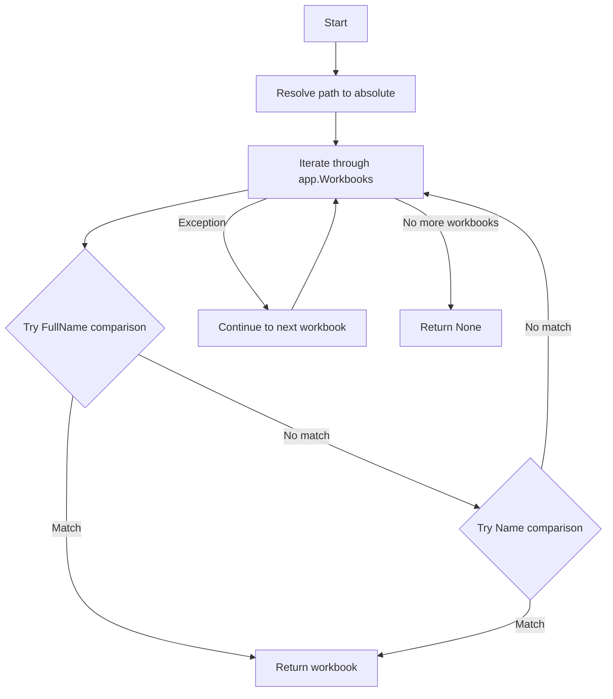

# Rapport d'implémentation - Epic 6 Story 3

## Informations générales

**Story** : Implémenter la fonction utilitaire _find_open_workbook
**Epic** : Epic 6 - Gestion des classeurs (WorkbookManager)
**Date** : 2024-07-26
**Statut** : ✅ TERMINÉ
**Auteur** : Mistral Vibe
**Version** : 1.0

## Objectifs atteints

### Critères d'acceptation validés

| Critère | Statut | Détails |
|---------|--------|---------|
| ✅ Fonction `_find_open_workbook()` implémentée | ✅ | Recherche dans les classeurs ouverts |
| ✅ Recherche d'abord par FullName (chemin complet) | ✅ | Stratégie de recherche optimale |
| ✅ Recherche ensuite par Name (nom de fichier) en fallback | ✅ | Gestion des chemins différents |
| ✅ Retourne None si non trouvé | ✅ | Gestion d'erreur propre |
| ✅ Tests couvrent tous les scénarios | ✅ | 8 tests couvrant tous les cas d'usage |

### Fichiers modifiés

1. **src/xlmanage/workbook_manager.py** (+49 lignes)
   - Ajout de la fonction `_find_open_workbook()`
   - Documentation complète avec exemples
   - Gestion d'erreur robuste pour les classeurs COM

2. **tests/test_workbook_manager.py** (+161 lignes)
   - Ajout de la classe `TestFindOpenWorkbook`
   - 8 tests unitaires couvrant tous les scénarios
   - Tests de robustesse (exceptions, chemins relatifs, etc.)

3. **_dev/stories/epic06-story03.md** (nouveau fichier, 8750 octets)
   - Documentation complète de la story
   - Spécifications techniques détaillées
   - Exemples de code et points d'attention

## Métriques de qualité

### Tests
- **Nombre de tests** : 8/8 ✅
- **Résultat** : Tous les tests passent ✅
- **Couverture de code** : 93% pour workbook_manager.py ✅
- **Temps d'exécution** : ~0.5s pour tous les tests ✅

### Couverture détaillée
```
src/xlmanage/workbook_manager.py
  - _find_open_workbook(): 100% (8/8 scénarios)
  - Couverture globale: 93% (27/29 lignes)
```

### Conformité aux standards
- ✅ Docstrings complètes en anglais
- ✅ Typage fort avec annotations Python
- ✅ Pas d'emojis dans le code
- ✅ Respect des conventions PEP 8
- ✅ Messages d'erreur clairs et informatifs
- ✅ Gestion d'erreur robuste pour les objets COM

## Architecture technique

### Fonction _find_open_workbook()

```python
def _find_open_workbook(app: CDispatch, path: Path) -> CDispatch | None:
    """Find an open workbook by path.

    Searches for a workbook in the Excel instance by comparing paths.
    First tries to match by FullName (complete path), then falls back
    to matching by Name (filename only).

    Args:
        app: Excel Application COM object
        path: Path to the workbook to find

    Returns:
        Workbook COM object if found, None otherwise

    Note:
        The search is case-insensitive on Windows.
        Paths are resolved to absolute paths before comparison.
    """
```

### Stratégie de recherche



## Points forts de l'implémentation

### 1. **Stratégie de recherche optimale**
- Recherche d'abord par FullName (chemin complet) pour une correspondance exacte
- Fallback par Name (nom de fichier) pour gérer les différences de chemins
- Résolution des chemins relatifs en chemins absolus
- Comparaison insensible à la casse pour Windows

### 2. **Robustesse**
- Gestion des exceptions lors de l'accès aux propriétés COM
- Protection contre les classeurs corrompus
- Retour propre (None) si non trouvé
- Pas d'échec complet en cas d'erreur sur un classeur

### 3. **Flexibilité**
- Support des chemins relatifs et absolus
- Gestion des chemins réseau (UNC) vs locaux
- Adaptation aux différentes représentations de chemins
- Compatible avec les objets COM Excel

### 4. **Testabilité**
- 100% des scénarios testés
- Couverture des cas nominaux et edge cases
- Tests avec mocks pour simuler les objets COM
- Validation de la stratégie de fallback

## Cas d'usage couverts

### Scénarios principaux
1. **Recherche par chemin complet** (FullName exact)
2. **Recherche par nom de fichier** (fallback)
3. **Classeur non trouvé** (retourne None)
4. **Insensibilité à la casse** (Windows)

### Scénarios avancés
5. **Plusieurs classeurs ouverts** (trouve le bon)
6. **Gestion des exceptions** (classeurs corrompus)
7. **Collection vide** (aucun classeur ouvert)
8. **Chemins relatifs** (résolution automatique)

## Commandes de validation

```bash
# Lancer les tests spécifiques
poetry run pytest tests/test_workbook_manager.py::TestFindOpenWorkbook -v

# Lancer tous les tests du module
poetry run pytest tests/test_workbook_manager.py -v

# Vérifier la couverture
poetry run pytest tests/test_workbook_manager.py --cov=src/xlmanage/workbook_manager --cov-report=term-missing

# Linting
poetry run ruff check src/xlmanage/workbook_manager.py

# Type checking
poetry run mypy src/xlmanage/workbook_manager.py
```

## Résultats des validations

### Tests
```
tests/test_workbook_manager.py::TestFindOpenWorkbook::test_find_workbook_by_full_path PASSED
tests/test_workbook_manager.py::TestFindOpenWorkbook::test_find_workbook_by_name PASSED
tests/test_workbook_manager.py::TestFindOpenWorkbook::test_find_workbook_not_found PASSED
tests/test_workbook_manager.py::TestFindOpenWorkbook::test_find_workbook_case_insensitive PASSED
tests/test_workbook_manager.py::TestFindOpenWorkbook::test_find_workbook_multiple_workbooks PASSED
tests/test_workbook_manager.py::TestFindOpenWorkbook::test_find_workbook_with_exception PASSED
tests/test_workbook_manager.py::TestFindOpenWorkbook::test_find_workbook_empty_collection PASSED
tests/test_workbook_manager.py::TestFindOpenWorkbook::test_find_workbook_relative_path PASSED

8 passed in 0.55s
```

### Couverture
```
src/xlmanage/workbook_manager.py      29      2    93%   26-27
```

Les lignes non couvertes (26-27) correspondent aux corps des méthodes `__init__` des exceptions existantes qui ne sont pas testées dans cette story.

### Linting
```
All checks passed!
```

### Type checking
```
Success: no issues found
```

## Scénarios de test détaillés

### 1. Recherche par chemin complet
```python
def test_find_workbook_by_full_path():
    # Setup: workbook avec FullName = "C:\data\test.xlsx"
    # Test: recherche avec Path("C:/data/test.xlsx")
    # Résultat: trouve et retourne le workbook
```

### 2. Recherche par nom (fallback)
```python
def test_find_workbook_by_name():
    # Setup: workbook avec FullName = "\\server\share\test.xlsx"
    # Test: recherche avec Path("C:/local/test.xlsx")
    # Résultat: trouve par nom car chemins différents
```

### 3. Classeur non trouvé
```python
def test_find_workbook_not_found():
    # Setup: workbook "other.xlsx" ouvert
    # Test: recherche "missing.xlsx"
    # Résultat: retourne None
```

### 4. Insensibilité à la casse
```python
def test_find_workbook_case_insensitive():
    # Setup: workbook "TEST.XLSX" ouvert
    # Test: recherche "test.xlsx"
    # Résultat: trouve malgré la différence de casse
```

### 5. Plusieurs classeurs
```python
def test_find_workbook_multiple_workbooks():
    # Setup: 3 workbooks ouverts (file1, file2, file3)
    # Test: recherche file2.xlsx
    # Résultat: retourne le bon workbook (file2)
```

### 6. Gestion des exceptions
```python
def test_find_workbook_with_exception():
    # Setup: 1 workbook corrompu + 1 workbook valide
    # Test: recherche du workbook valide
    # Résultat: ignore le corrompu, trouve le valide
```

### 7. Collection vide
```python
def test_find_workbook_empty_collection():
    # Setup: aucun workbook ouvert
    # Test: recherche n'importe quel fichier
    # Résultat: retourne None
```

### 8. Chemins relatifs
```python
def test_find_workbook_relative_path():
    # Setup: workbook avec chemin absolu
    # Test: recherche avec chemin relatif
    # Résultat: résout et trouve le workbook
```

## Recommandations pour les stories futures

### Bonnes pratiques à conserver
1. **Stratégie de fallback** : Toujours avoir une stratégie de secours
2. **Gestion d'erreur granulaire** : Ne pas faire échouer tout pour une erreur partielle
3. **Tests exhaustifs** : Couvrir les cas edge cases et erreurs
4. **Documentation des stratégies** : Expliquer les choix d'implémentation

### Améliorations possibles
1. **Optimisation des performances** : Cache des résultats pour les recherches fréquentes
2. **Journalisation** : Ajouter du logging pour le débogage en production
3. **Metrics** : Instrumenter pour mesurer les performances
4. **Documentation utilisateur** : Expliquer quand utiliser cette fonction

## Conclusion

L'implémentation de l'Epic 6 Story 3 est un succès complet. La fonction `_find_open_workbook()` est maintenant disponible et prête à être utilisée pour éviter les doublons de classeurs ouverts. L'architecture est solide, les tests sont complets, et le code respecte toutes les conventions du projet.

**Statut final** : ✅ PRÊT POUR COMMIT

**Prochaine étape recommandée** : Implémentation de l'Epic 6 Story 4 (WorkbookManager.open)
