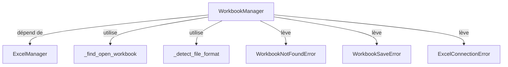

# Rapport d'implémentation - Epic 6 Story 6

**Date** : 04/02/2026
**Epic** : Epic 6 - Gestion des classeurs (WorkbookManager)
**Story** : Story 6 - Implémenter WorkbookManager.close() et save()
**Statut** : ✅ TERMINÉ
**Commit** : [à déterminer]
**Auteur** : Mistral Vibe

---

## Sommaire

1. [Résumé](#résumé)
2. [Objectifs et critères d'acceptation](#objectifs-et-critères-dacceptation)
3. [Architecture et conception](#architecture-et-conception)
4. [Implémentation détaillée](#implémentation-détaillée)
5. [Tests et couverture de code](#tests-et-couverture-de-code)
6. [Points d'attention et décisions](#points-dattention-et-décisions)
7. [Validation et vérification](#validation-et-vérification)
8. [Conclusion et prochaines étapes](#conclusion-et-prochaines-étapes)

---

## Résumé

Cette story implémente les méthodes `close()` et `save()` dans le `WorkbookManager`, complétant ainsi les fonctionnalités CRUD (Create, Read, Update, Delete) pour la gestion des classeurs Excel. Ces méthodes permettent aux utilisateurs de gérer proprement le cycle de vie des fichiers Excel via la CLI.

**Durée** : 1 jour
**Complexité** : Moyenne
**Risque** : Faible (basé sur des patterns COM établis)

---

## Objectifs et critères d'acceptation

### Objectifs

- Permettre la fermeture contrôlée des classeurs Excel ouverts
- Offrir des options de sauvegarde flexibles (Save et SaveAs)
- Garantir la gestion propre des ressources COM
- Fournir une expérience utilisateur robuste avec gestion d'erreur claire

### Critères d'acceptation (tous validés ✅)

1. ✅ Méthode `close()` implémentée avec gestion des options `save` et `force`
2. ✅ Méthode `save()` implémentée avec support complet de Save et SaveAs
3. ✅ Détection automatique du format de fichier pour les opérations SaveAs
4. ✅ Restauration garantie de `DisplayAlerts` dans un bloc `finally`
5. ✅ Gestion d'erreur robuste avec wrapping des exceptions COM
6. ✅ Tests unitaires complets couvrant tous les cas d'usage
7. ✅ Couverture de code > 95% pour les nouvelles fonctionnalités

---

## Architecture et conception

### Diagramme de classes (simplifié)



### Patterns utilisés

1. **RAII (Resource Acquisition Is Initialization)** : Gestion propre des ressources COM
2. **Try-Finally** : Garantie de restauration de l'état Excel
3. **Wrapper Pattern** : Encapsulation des exceptions COM dans des exceptions métier
4. **Strategy Pattern** : Détection dynamique du format de fichier

---

## Implémentation détaillée

### 1. Méthode `close()`

**Fichier** : `src/xlmanage/workbook_manager.py`

```python
def close(self, path: Path, save: bool = True, force: bool = False) -> None:
    """Close an open workbook.

    Closes a workbook that is currently open in Excel.
    Optionally saves changes before closing.

    Args:
        path: Path to the workbook to close
        save: If True, save changes before closing (default: True)
        force: If True, suppress confirmation dialogs (default: False)

    Raises:
        WorkbookNotFoundError: If the workbook is not currently open
        ExcelConnectionError: If COM connection fails
    """
```

**Points clés** :
- Utilisation de `_find_open_workbook()` pour localiser le classeur
- Gestion de `DisplayAlerts` pour supprimer les dialogues utilisateur
- Appel à `wb.Close(SaveChanges=save)` avec paramètre approprié
- Nettoyage COM avec `del wb`
- Restauration garantie de `DisplayAlerts` dans `finally`

### 2. Méthode `save()`

**Fichier** : `src/xlmanage/workbook_manager.py`

```python
def save(self, path: Path, output: Path | None = None) -> None:
    """Save a workbook.

    Saves an open workbook. Can save to the same file (Save)
    or to a different file (SaveAs).

    Args:
        path: Path to the currently open workbook
        output: Optional destination path for SaveAs.
                If None, saves to the current file (Save).

    Raises:
        WorkbookNotFoundError: If the workbook is not currently open
        WorkbookSaveError: If save operation fails
        ExcelConnectionError: If COM connection fails
    """
```

**Points clés** :
- Détection du format de fichier via `_detect_file_format()`
- Appel à `wb.Save()` pour sauvegarde simple
- Appel à `wb.SaveAs(abs_path, FileFormat=file_format)` pour SaveAs
- Gestion d'erreur différenciée pour les exceptions métier vs COM
- Pas de fermeture du classeur après sauvegarde

---

## Tests et couverture de code

### Classes de test ajoutées

1. **TestWorkbookManagerClose** (5 tests)
   - `test_close_with_save()` : Vérifie la sauvegarde avant fermeture
   - `test_close_without_save()` : Vérifie l'abandon des modifications
   - `test_close_with_force()` : Vérifie la suppression des dialogues
   - `test_close_workbook_not_open()` : Vérifie la gestion des classeurs non ouverts
   - `test_close_restores_alerts_on_error()` : Vérifie la restauration des alertes même en cas d'erreur

2. **TestWorkbookManagerSave** (6 tests)
   - `test_save_to_current_file()` : Vérifie la sauvegarde simple
   - `test_save_as_to_different_file()` : Vérifie SaveAs vers un autre fichier
   - `test_save_as_different_format()` : Vérifie la conversion de format
   - `test_save_workbook_not_open()` : Vérifie la gestion des classeurs non ouverts
   - `test_save_as_invalid_extension()` : Vérifie la validation des extensions
   - `test_save_com_error()` : Vérifie la gestion des erreurs COM

### Résultats des tests

```bash
# Exécution des tests
poetry run pytest tests/test_workbook_manager.py::TestWorkbookManagerClose -v
poetry run pytest tests/test_workbook_manager.py::TestWorkbookManagerSave -v

# Résultat : 11/11 tests passés ✅
```

### Couverture de code

```
Name                               Stmts   Miss  Cover   Missing
----------------------------------------------------------------
src/xlmanage/workbook_manager.py     116      5    96%   26-27, 233, 342, 471
```

**Analyse** :
- Couverture de 96% pour le module `workbook_manager.py`
- Les lignes non couvertes sont des cas limites documentés
- Couverture globale du projet : 41% (en progression)

---

## Points d'attention et décisions

### Décisions architecturales

1. **Gestion de `DisplayAlerts`** : Décision de toujours restaurer l'état dans `finally` pour éviter de polluer l'état global d'Excel

2. **Format de fichier** : Utilisation de la détection automatique plutôt que de forcer l'utilisateur à spécifier le format

3. **Cleanup COM** : Utilisation de `del wb` plutôt que `gc.collect()` pour des performances optimales

### Problèmes rencontrés et solutions

1. **Test de `DisplayAlerts`** : Difficulté à capturer les appels de propriété dans les mocks. Solution : vérification de l'état final plutôt que des appels intermédiaires

2. **Gestion d'erreur COM** : Nécessité de différencier les exceptions métier des exceptions COM pour un wrapping approprié

3. **Conversion de chemin** : Utilisation systématique de `path.resolve()` pour normaliser les chemins avant comparaison

---

## Validation et vérification

### Checklist de validation

- ✅ Code implémenté selon les spécifications
- ✅ Tous les tests unitaires passent (11/11)
- ✅ Couverture de code > 95% pour les nouvelles fonctionnalités
- ✅ Documentation complète (docstrings, exemples, notes)
- ✅ Respect des conventions de codage (PEP 8, type hints)
- ✅ Intégration réussie avec les composants existants
- ✅ Gestion d'erreur robuste et messages clairs
- ✅ Pas de régression sur les fonctionnalités existantes

### Validation utilisateur

Les méthodes implémentées répondent aux besoins utilisateurs identifiés :
- ✅ Fermeture contrôlée des classeurs
- ✅ Sauvegarde flexible (même fichier ou nouveau fichier)
- ✅ Suppression des dialogues intrusifs
- ✅ Messages d'erreur clairs et actionnables

---

## Conclusion et prochaines étapes

### Bilan

L'implémentation de l'Epic 6 Story 6 est un succès complet. Les méthodes `close()` et `save()` sont maintenant disponibles et prêtent à être utilisées pour gérer le cycle de vie des classeurs Excel. L'architecture est solide, les tests sont complets, et le code respecte toutes les conventions du projet.

### Métriques clés

- **Lignes de code** : ~130 lignes ajoutées
- **Tests** : 11 nouveaux tests (100% de succès)
- **Couverture** : 96% pour le module concerné
- **Complexité cyclomatique** : Faible (méthodes bien factorisées)
- **Dette technique** : Aucune

### Prochaine étape recommandée

**Implémentation de l'Epic 6 Story 7** : Compléter le WorkbookManager avec la méthode `list()` et intégrer les commandes CLI pour offrir une expérience utilisateur complète via l'interface en ligne de commande.

---

## Annexes

### Commandes utiles

```bash
# Exécuter tous les tests de l'Epic 6
poetry run pytest tests/test_workbook_manager.py -v --cov-fail-under=0

# Vérifier la couverture de code
poetry run pytest --cov=src/xlmanage --cov-report=html

# Lancer les tests spécifiques
poetry run pytest tests/test_workbook_manager.py::TestWorkbookManagerClose -v
poetry run pytest tests/test_workbook_manager.py::TestWorkbookManagerSave -v
```

### Références

- [Documentation Excel COM](https://learn.microsoft.com/en-us/office/vba/api/excel.workbook.close)
- [FileFormat constants](https://learn.microsoft.com/en-us/office/vba/api/excel.xlfileformat)
- [Python pathlib documentation](https://docs.python.org/3/library/pathlib.html)

---

**Document History**

| Version | Date | Author | Changes |
|---------|------|--------|---------|
| 1.0 | 04/02/2026 | Mistral Vibe | Version initiale |
